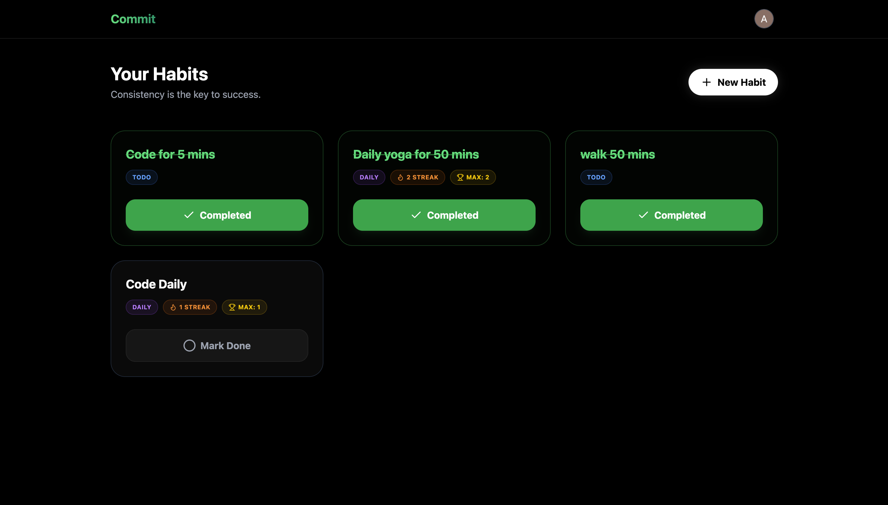
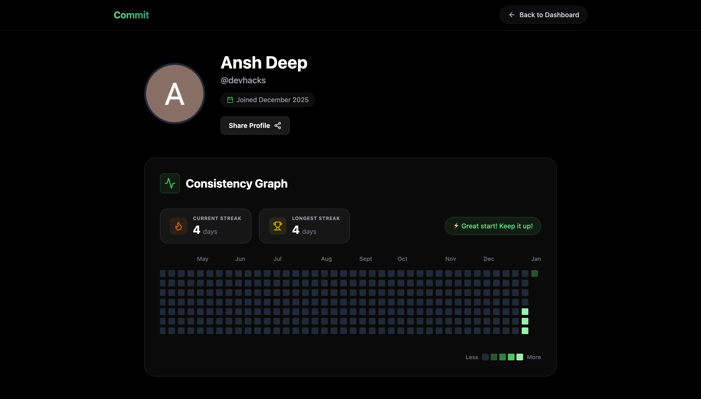

# Commit - The Modern Habit Tracker

<p align="center">
  
</p>

<p align="center">
  
  
  
</p>

<p align="center">
  <strong>Master your consistency with GitHub-style contribution graphs.</strong>
</p>

<p align="center">
  <a href="https://commit-liard.vercel.app/"><strong>🔴 Live Demo</strong></a> • 
  <a href="#-features">Features</a> • 
  <a href="#-tech-stack">Tech Stack</a> • 
  <a href="#-getting-started">Getting Started</a>
</p>

**Commit** is a sleek, minimalist habit tracking application designed to help you build consistency and achieve your goals. With a focus on visual streaks ("Flames") and social accountability, Commit makes self-improvement satisfying and shareable.

## 🚀 Features

- **🔥 Streak Tracking**: Visualize your consistency with dynamic flame indicators and streak counters.
- **📊 Dashboard**: A clean, grid-based interface to manage your daily habits and one-time tasks.
- **🔒 Privacy & Public Profiles**: Share your progress with a public profile link (`/u/username`) while keeping sensitive habits private.
- **📂 Archive System**: Declutter your dashboard by archiving old habits without losing your history.
- **✨ Smooth Animations**: A polished user experience featuring fluid transitions and interactive elements.
- **🔐 Secure Authentication**: Robust login system using JWT and Google OAuth integration.
- **📱 Responsive Design**: Fully optimized for seamless use across desktop and mobile devices.

## 📸 Screenshots

<p align="center">
  
</p>
<p align="center">
  
</p>

## 🛠️ Tech Stack

### Frontend
- **Framework**: React (Vite)
- **Styling**: Tailwind CSS
- **Animations**: Framer Motion
- **Icons**: Lucide React
- **State Management**: React Hooks

### Backend
- **Runtime**: Node.js
- **Framework**: Express.js
- **Database**: MongoDB (Mongoose)
- **Authentication**: JWT (JSON Web Tokens) & Google OAuth

## ⚡ Getting Started

### Prerequisites
- Node.js (v16+)
- MongoDB (Local or Atlas)

### Installation

1. **Clone the repository**
   ```bash
   git clone https://github.com/Enthusiast-AD/Hobby-Track
   cd hobby-track
   ```

2. **Backend Setup**
   ```bash
   cd backend
   npm install
   ```
   Create a `.env` file in the `backend` directory:
   ```env
   PORT=8000
   MONGODB_URI=your_mongodb_connection_string
   CORS_ORIGIN=*
   ACCESS_TOKEN_SECRET=your_access_secret
   ACCESS_TOKEN_EXPIRY=1d
   REFRESH_TOKEN_SECRET=your_refresh_secret
   REFRESH_TOKEN_EXPIRY=10d
   ```
   Start the server:
   ```bash
   npm run dev
   ```

3. **Frontend Setup**
   ```bash
   cd ../frontend
   npm install
   ```
   Create a `.env` file in the `frontend` directory:
   ```env
   VITE_API_URL=http://localhost:8000
   VITE_GOOGLE_CLIENT_ID=your_google_client_id
   ```
   Start the development server:
   ```bash
   npm run dev
   ```

## 🤝 Contributing

Contributions are welcome! Please feel free to submit a Pull Request.

1. Fork the project
2. Create your feature branch (`git checkout -b feature/AmazingFeature`)
3. Commit your changes (`git commit -m 'Add some AmazingFeature'`)
4. Push to the branch (`git push origin feature/AmazingFeature`)
5. Open a Pull Request

## 📄 License

This project is licensed under the MIT License - see the [LICENSE](LICENSE) file for details.
